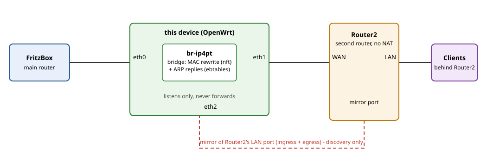

# ipv4-passthrough

Makes devices behind a second router show up as ordinary devices in the
FritzBox's network overview — for IPv4, not just IPv6.

## The problem

Many home networks have a FritzBox as the main router, plus a second
router behind it that is kept for its own features (this README calls it
**Router2**). Router2 gets its own IPv4 subnet and routes (without NAT)
between the FritzBox and its clients.

The FritzBox only sees devices on its own network segment. Everything
behind Router2 is, from its point of view, just traffic coming from one
single device: Router2. The individual clients (laptops, phones, ...) never
appear in the FritzBox's device list, so you can't see, name or manage
them there.

Router2 may have a "passthrough" mode that would fix this by making itself
invisible, but it only offers it for IPv6. For IPv4 there is no such
option, so IPv6 clients show up correctly while the same clients are
missing for IPv4.

### Requirements for Router2

- **IPv4 NAT must be disabled** on Router2, so clients keep their own
  addresses on the wire. This is the only requirement if you don't need
  IPv6 behind Router2; this project then works with any such router.
- **If IPv6 is also needed behind Router2, its IPv6 passthrough mode is a
  hard requirement.** This project does nothing for IPv6 (see
  [How it works](#how-it-works)); it relies on Router2 already handing
  IPv6 through correctly.

Example: the author's Router2 is a TP-Link Omada MR707-M2 with NAT
disabled for IPv4 and IPv6 in passthrough mode.

Omada's documentation doesn't describe how its IPv6 passthrough mode works
internally. Newer Omada devices appear to be based on OpenWrt, so the
closest documented behaviour is that of OpenWrt's
[`odhcpd`](https://github.com/openwrt/odhcpd): it can relay Router
Advertisements, DHCPv6 and NDP between routed (non-bridged) interfaces,
without needing a delegated prefix of its own. Note that odhcpd calls this
mode "relay", not "passthrough", and that Omada's mode may not be built on
it; treat it as a plausible explanation, not a confirmed one.

## What this project does

It emulates the missing IPv4 passthrough with a small OpenWrt device placed
between the FritzBox and Router2 (see [Topology](#topology)). The device
passes all traffic through unchanged at the IP level, but rewrites the
Ethernet (MAC) addresses so the FritzBox sees each client behind Router2
with its own real MAC address. The result: every client appears in the
FritzBox's network overview as a normal local device, even though it sits
on a different subnet, and Router2 itself "disappears" as a hop.

The device learns the clients automatically by passively watching a mirror
port on Router2, and forgets them again when they go silent; nothing needs
to be configured per client.

See `SPEC.md` for the full functional/non-functional requirements this
implementation is built against.

## Topology



Text version:

```
FritzBox LAN --- eth0 [ this device ] eth1 --- Router2 WAN
                        (bridged)               |
                                              Router2 LAN --- clients
                                                   |
                                                  (mirrored port)
                                                   |
                                                  eth2 [ this device ]
```

- `eth0` + `eth1`: a plain Linux bridge (`br-ip4pt`). IP data passes
  through untouched at the routing level; only the Ethernet header is
  ever rewritten (see below).
- `eth2`: connects to a free port on Router2 that's configured to
  mirror its main LAN port (ingress + egress). Used for discovery only
  — never bridged, never forwards anything.

## How it works

- **IPv6**: nothing to do. A bridge never touches the Ethernet header,
  so whatever already makes v6 clients show up correctly (Router2's
  native passthrough preserving the real MAC end-to-end) keeps working
  exactly as it does without this device in the picture.
- **IPv4 data plane**: an nftables bridge-family rule
  (`10-ip4pt.nft.tmpl`) rewrites the source MAC on frames leaving
  toward eth0 to the client's real MAC (looked up by source IP), and
  forces the destination MAC on frames leaving toward eth1 to Router2's
  real MAC.
- **IPv4 ARP replies**: one `ebtables -t nat ... -j arpreply` rule per
  known client answers the FritzBox's ARP requests with that client's
  real MAC — on demand only, never gratuitous, and no interface of any
  kind per client.
- **Discovery**: `ip4pt-discover.sh` passively watches eth2. Because
  that port genuinely mirrors all traffic (not just broadcasts), it
  sees complete ARP conversations — replies included — so passive
  listening alone is a reliable source; no active probing needed.
- **Client names**: a second capture in the same daemon watches DHCP
  requests on eth2 and stores each client's option-12 hostname under
  `/etc/ip4pt/state/names/<mac>` (keyed by MAC — at DHCP time there is
  often no IP yet, and the MAC survives IP churn). Purely informational:
  the LuCI page joins it in by MAC for its Name column; nothing about
  discovery or provisioning consumes it.
- **Persistence**: learned (IP, MAC) pairs live under `/etc/ip4pt/state`
  (survives reboots, unlike `/tmp`), since the client set on Router2's
  LAN is expected to stay fairly stable. `restore_hosts()` re-applies
  every persisted pair as nft map entries + ebtables rules at startup,
  since that kernel-side state doesn't itself survive a reboot even
  though the files do.
- **Garbage collection**: `ip4pt-gc.sh` drops a client's rules after
  `STALE_SECS` (30 days by default — churn is expected to be rare) of
  silence on eth2. The FritzBox's own entry just flips to "offline" on
  its own once its ARP cache ages out; nothing needs to be forced from
  this side.
- **Offline propagation (two-tier GC)**: silence on the mirror is graded.
  After `OFFLINE_SECS` (15 min by default) of no observed ARP from a
  client, GC *suspends* it: only the arpreply rule is removed — the
  FritzBox's own probes then go unanswered, so its overview flips that
  client to offline within minutes, and the same mechanism makes an
  offline Router2 client show offline in the FritzBox shortly after.
  The binding, the nft map element and the state file all stay, so the
  client is answered again (and back online) within a second of its
  next ARP appearing on the mirror. Only after the full `STALE_SECS`
  does the binding itself get dropped. Both knobs live in
  `ip4pt.conf`; `OFFLINE_SECS=0` disables the tier (silent hosts then
  stay online until `STALE_SECS`).

DHCP snooping for *discovery* is still deliberately not done: ARP on the
mirrored port already covers it reliably (FR-7). But the *hostname* part
of the old idea is now implemented (FR-14): the discovery daemon runs a
second capture on eth2 (`tcpdump -v 'udp dst port 67'`), parses the
option-12 `Hostname` out of DHCP requests clients send, and stores it
per client MAC under `/etc/ip4pt/state/names/` — display-only (the LuCI
status page shows it in the first column, “—” when the client sent no
name, as with iOS). It never feeds the binding machinery. The verbose
multi-line parsing is why this needed its own `-v` capture: `-v` changes
the ARP line wording, so the two streams can never share one tcpdump.

## Files

| File | Purpose |
|---|---|
| `ip4pt.conf` | All site-specific settings |
| `ip4pt-lib.sh` | Shared functions (sourced by the two daemons below) |
| `ip4pt-discover.sh` | Passive ARP listener on eth2 -> provisions hosts; also parses DHCP requests for client hostnames |
| `ip4pt-gc.sh` | Drops stale hosts after `STALE_SECS` |
| `10-ip4pt.nft.tmpl` | nftables bridge-family MAC rewrite (template) |
| `ip4pt-gen-nft.sh` | Renders the template using `ROUTER2_MAC`, loads it directly via `nft -f` |
| `ip4pt.init` | OpenWrt procd service running the two daemons |
| `package/ip4pt/` | OpenWrt package: `Makefile` + `files/` mapping the sources into the canonical paths (`/usr/lib/ip4pt`, `/usr/bin`, `/etc/ip4pt`, `/etc/init.d`, `/lib/upgrade/keep.d`) |
| `package/luci-app-ip4pt/` | Optional OpenWrt package: read-only LuCI status page (see below) |
| `tests/` | `test-parser.sh` + `test-e2e.sh` (see below) |
| `justfile` | Task runner: `just test`, `just check`, `just package-build`, … |
| `SPEC.md` | Functional and non-functional requirements |

All site-specific values live in `ip4pt.conf` and reach everything else by
substitution: the daemons source it directly, and `ip4pt-gen-nft` fills the
`@ROUTER2_MAC@` / `@UPLINK@` / `@DOWNLINK@` placeholders in the nft template
(NFR-6 — one place per value).

## Tests

Two suites, deliberately kept minimal. If you have
[`just`](https://just.systems) installed, `just test` runs both (and
`just` alone lists everything, incl. `just check` for `sh -n` linting and
`just package-build` for the OpenWrt SDK build); the raw commands
below work just as well without it:

```sh
sh tests/test-parser.sh   # root-free: feeds recorded tcpdump ARP lines
                          # through ip4pt-discover.sh with every external
                          # command stubbed; asserts which bindings land in
                          # state, the nft map, and the ebtables rule log.
sh tests/test-e2e.sh      # rootless full chain: builds the FritzBox /
                          # device / Router2 / client topology in network
                          # namespaces under one throw-away `unshare -rmn`
                          # (no root on the host needed), fakes Router2's
                          # mirrored port with `tc mirred`, and checks
                          # discovery, the arpreply answer, the on-wire MAC
                          # rewrite, no-NAT, no unsolicited ARP, and reboot
                          # persistence via restore_hosts.
```

The E2E suite needs nothing but `unshare`, `iproute2` (with `tc`),
`nftables`, `ebtables`, `tcpdump` and `iputils-ping` installed on the host
— it never requires root on the host, since the whole lab runs inside a
private user-namespace in which it holds root itself. Everything left out
(the real FritzBox TR-064 device list, QEMU on the exact target build, the
physical rig) stays as the manual on-device checklist in
[Things to validate](#things-to-validate).

## Install

```sh
apk update
apk add tcpdump ebtables
# confirm arpreply is actually present in your ebtables build:
ebtables -t nat -L 2>&1 | head -1   # should not error
```

Bridge (UCI network config):

```
config device
    option name 'br-ip4pt'
    option type 'bridge'
    list ports 'eth0'
    list ports 'eth1'
    option stp '0'

config interface 'ip4pt'
    option device 'br-ip4pt'
    option proto 'none'
```

Don't attach this interface to any firewall zone with masquerading
enabled — give it its own zone (or none) with input/output/forward
accept, so the default LAN/WAN NAT rules never touch this traffic.

Get Router2's real WAN-facing MAC once traffic has flowed, and put it in
`ip4pt.conf`:

```sh
bridge fdb show dev eth1
```

Then install everything:

```sh
mkdir -p /etc/ip4pt
cp ip4pt.conf ip4pt-lib.sh ip4pt-discover.sh ip4pt-gc.sh \
   ip4pt-gen-nft.sh 10-ip4pt.nft.tmpl /etc/ip4pt/
chmod +x /etc/ip4pt/ip4pt-discover.sh /etc/ip4pt/ip4pt-gc.sh \
         /etc/ip4pt/ip4pt-gen-nft.sh

/etc/ip4pt/ip4pt-gen-nft.sh   # renders /etc/ip4pt/10-ip4pt.nft + loads it
                              # via `nft -f` (NOT via fw4 -- see the note
                              # on /etc/nftables.d below)

cp ip4pt.init /etc/init.d/ip4pt
chmod +x /etc/init.d/ip4pt
/etc/init.d/ip4pt enable
/etc/init.d/ip4pt start
```

If `ROUTER2_MAC` ever changes, update it in `ip4pt.conf` and re-run
`ip4pt-gen-nft.sh` -- that's the only place it needs to be set.

Why the ruleset is loaded with `nft -f` and not dropped into
`/etc/nftables.d/`: fw4 includes those files *inside* `table inet fw4`,
where a full `table bridge ip4pt` declaration is a syntax error that breaks
every firewall reload. A directly-loaded bridge table lives outside fw4's
table and is untouched by fw4 reloads (verified on-device: a probe table
survives `/etc/init.d/firewall reload`), which is also why the daemons'
same-MAC refresh path exists as a belt-and-braces safety net for the rare
case where something else deletes the table.

## Installing as an OpenWrt package (25.12+)

`package/ip4pt/` turns the same sources into a real package. Repo layout
stays flat; the package's `files/` tree re-maps everything into OpenWrt's
canonical paths at build time (`/usr/lib/ip4pt/` for code, `/etc/ip4pt/` for
config and state, the init script under `/etc/init.d/`). Nothing needs the
real `/etc/ip4pt` at build time.

Build with the 25.12 SDK for your target.

The easy path — `just` fetches and prepares the SDK for you
(target defaults to `mediatek/filogic`, override with
`just package-build sdk=<dir>` for a pre-existing SDK):

```sh
just package-build
# -> dist/mediatek-filogic/ip4pt-1.0.0-r1.apk
```

By hand, in an SDK you already unpacked:

```sh
make defconfig && make menuconfig          # select Network -> ip4pt
make package/ip4pt/compile V=s             # ~2 min: walks the whole pkg tree
# -> bin/packages/<arch>/base/ip4pt-1.0.0-r1.apk   (PKGARCH:=all --
#    one .apk covers every target arch since the package is pure shell)
```

Note the filename is `ip4pt-1.0.0-r1.apk` (no `_all` in it — that only
appears in the SDK path when a variant is built). The `just` recipe is much
faster on repeat builds because it invokes make *inside* `package/ip4pt/`
instead of from the SDK root, which skips the SDK's traversal of every
package/kmod in the tree (~100× on this box, ~1 s vs ~110 s); it runs the
full path once to bootstrap the SDK staging area.

On the device (25.12+ uses apk, not opkg):

```sh
apk add --allow-untrusted ./ip4pt-1.0.0-r1.apk
# then follow the same manual steps as above: build the br-ip4pt UCI
# bridge (this device already has it as br-lan -- either name works,
# ip4pt never references the bridge by name), set ROUTER2_MAC in
# /etc/ip4pt/ip4pt.conf, run /usr/bin/ip4pt-gen-nft once, then
# /etc/init.d/ip4pt enable && start.
```

Notes: `/etc/ip4pt/ip4pt.conf` is a conffile (edits survive package
upgrades), and `package/ip4pt/files/lib/upgrade/keep.d/ip4pt` keeps
`/etc/ip4pt/state/` across a sysupgrade so bindings don't have to be
relearned after an OS update either. `apk` resolves `tcpdump`, `ebtables`,
`kmod-ebtables-ipv4` and `kmod-nft-bridge` itself — and if a build can't
provide the `ebt_arpreply` kernel target (README item 1 below), the package
simply won't install, instead of failing at runtime. Per-device values (the
bridge, `ROUTER2_MAC`) deliberately stay manual — they're hardware-specific,
not packageable.

Two behaviors the implementation relies on were verified by the E2E test
and fixed where they were wrong: procd `respawn` re-running
`restore_hosts()` no longer creates duplicate ebtables rules (adds are now
idempotent), and the same-MAC refresh re-asserts the map entry in case
something deleted the table out from under the running daemons (the table
itself no longer depends on fw4 reloads, which never touched it anyway —
see the load-path note above).

A third, more subtle one: procd signals only the tracked pid, never a
`tcpdump | while read` pipeline's children — so every stop/restart used to
leak an orphaned tcpdump + reader that kept provisioning in the shadows
(observed on a production device after several restarts). The discovery
daemon therefore runs as a supervisor: the capture is backgrounded into a
FIFO, the read loop is a child, and the main shell blocks in `wait` (the
one place every POSIX shell runs pending traps immediately) with a TERM
trap that reaps both children. A SIGTERM to the daemon pid alone — all
procd ever sends — now takes the whole chain down; the E2E suite pins
this with an explicit orphan-regression check. Plain
`/etc/init.d/ip4pt restart` is safe again; `ps | grep tcpdump` should
show exactly one capture while the service runs.
## Optional: LuCI status page (`luci-app-ip4pt`)

`package/luci-app-ip4pt/` is a separate, optional package (standard
`luci-app-*` naming) that adds a read-only page under **Status → IPv4
Passthrough**. It lists every handled host — its DHCP hostname in the
first column (Name; shows "—" when the client never sent one, as with
iOS, and names appear as leases renew, not instantly), then IP, MAC,
how long silent, Online/Suspended, and the countdowns to both lifecycle
tiers (suspension after `OFFLINE_SECS`, removal after `STALE_SECS`).

It stores nothing twice: `/usr/libexec/ip4pt-status` derives its JSON from
ip4pt's own state files (mtimes = last-seen; the Name column joins the
per-MAC hostname files the discovery daemon's DHCP capture writes) plus the
ebtables listing via the lib's `arpreply_present` — the same sources of
truth the GC uses. The table is sortable — click a column header. This is
the same `cbi_update_table()` binding the core Status → Routes page uses,
and the chosen sort survives the 30 s auto-refresh.

Each row has a **Remove** button (Actions column). It runs
`/usr/libexec/ip4pt-remove <ip>` — the same `deprovision_host` the GC's
`STALE_SECS` tier performs (state file, nft map element and ebtables
arpreply rule all go) — after a confirmation dialog. A removed host is
re-learned automatically from its next ARP, so a mistaken removal
self-heals. The write is gated by a dedicated rpcd ACL granting exec on
`/usr/libexec/ip4pt-remove *` only, and the helper itself validates the
argument as a strict dotted quad (it becomes a file path, so nothing
else is ever touched). Removing a binding never deletes the client's
name file — names are not bindings; a returning client refreshes its
name anyway.

Above the table there is a **Remove all suspended** button (always
visible, greyed out while no suspended rows exist; the label shows the
live count). It runs `/usr/libexec/ip4pt-remove --suspended`, which
re-checks each binding's arpreply-rule presence at run time and
deprovisions exactly the set the page shows as Suspended — a host that
came back meanwhile (its rule re-asserted by discovery) is never caught
by the sweep. Same confirmation dialog, same self-healing, one rpcd
exec instead of N.

```sh
just package-build          # builds both apks into dist/<target>/
# on the device:
apk add --allow-untrusted ./ip4pt-*.apk ./luci-app-ip4pt-*.apk
/etc/init.d/rpcd restart    # picks up the new ACL
# then log out and back in to LuCI (the ACL applies to new sessions)
```

The page auto-refreshes every 30 s. If the discovery daemon is down, a
banner warns that the Status column is unreliable (rules are re-added
from state on restart, so hosts briefly read "Suspended").
## Things to validate

1. **ebtables `arpreply` availability** on your actual OpenWrt build --
   it's a legacy xtables extension and occasionally missing from
   fw4/nftables-only images. If it's not packaged, the fallback is a
   userspace listener crafting raw ARP replies (e.g. via `socat`'s
   PACKET address type), which is more fragile and worth avoiding if
   `arpreply` is available. **Check on target**: `kmod-ebtables-ipv4`
   maps `CONFIG_BRIDGE_EBT_ARPREPLY`, and the package declares
   `+kmod-ebtables-ipv4`, so apk refuses to install on a build that lacks
   it; the E2E suite's preflight test answers the same question for the
   running kernel.
2. **tcpdump output parsing** in `ip4pt-discover.sh` -- formats vary
   slightly by version; verify against your device's actual output
   (`tcpdump -i eth2 -Z root -l -n -e arp`) and adjust the `sed`/`awk`
   patterns if needed. `tests/test-parser.sh` pins the modern + older
   dialects against recorded fixtures.
3. **Flash wear from persisting to `/etc`** -- writes are infrequent
   (only on a genuinely new/changed binding or an occasional `touch`
   refresh), so this should be a non-issue on typical home-router
   flash, but worth keeping an eye on if `STATE_DIR` ends up getting
   touched much more often than expected.
4. **Rotating MAC addresses** -- not a concern as configured (rotation
   disabled on all home-network clients). If that ever changes on a
   given device, it will reappear as a new "PC-<MAC>" entry on every
   reconnect -- a client-side setting, not something fixable here.
5. **`ether saddr set ip saddr map @ip2mac` semantics** -- **verified** by
   the E2E suite: an unmapped source IP passes the frame through unchanged
   (no translation, no error), and a mapped one is rewritten to the stored
   MAC. Note that the map can end up holding the gateway's own
   IP->LAN-MAC binding (learned from an ARP request *sent by* the gateway);
   that entry is the identity mapping and therefore harmless — the E2E
   confirms traffic still flows with it present. It is not filtered,
   because distinguishing the gateway from a client would mean hard-coding
   the client subnet (NFR-6).
6. **Interface-name substitution** -- `10-ip4pt.nft.tmpl` contains
   `@UPLINK@` / `@DOWNLINK@` placeholders (like `@ROUTER2_MAC@`), filled in
   by `ip4pt-gen-nft` from `ip4pt.conf`. So the interfaces are defined in
   exactly one place (NFR-6); if you change a port, update `ip4pt.conf` and
   re-run the generator. Note the E2E test renders the template itself with
   its own literals — that's the harness, not a second config.
